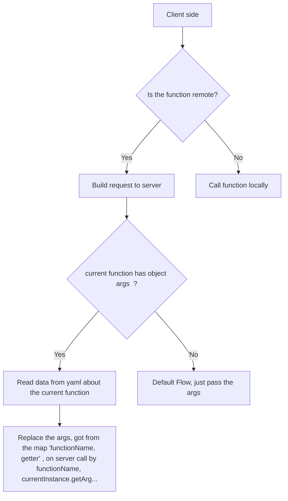
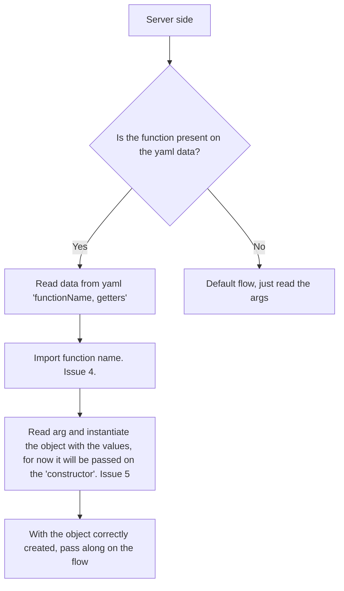

```yaml

functions:
    - declarationPattern: useCase
      method: http-get
      object-args:
        - objectName:
            - getter.arg1
        - functionArg:
            - getter.arg1
```

Then, when generating server
replace identifier by <objectArgs> name, and each respective arg pass as <objectArgs>-<num>: arg

## Issues:

1. ### How to collect args for each functions ?It can come from a long chain...  BIG ISSUE
2. How to generate the server correctly ?
3. When passing the arg, how to detect it and replace correctly ?
4. How to import the function on the "remote" server ?
5. How to assemble the object correctly on the "remote" server ?

Solutions:
1. The arg1 on the yaml could be a "getter", therefor we can use it to retrieve the argument for the current posicional parameter.(fix long chain of calls) but the developer would need to implement a getter for all parameters...not a real issue...but...


## Workflow

### First Idea

On the client side:
    

---
On the server side:

